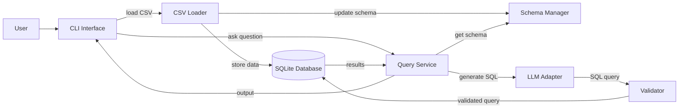

# LLM SQL Project

## Overview
Load CSV into SQLite, query with natural language. LLM converts questions to SQL, validator ensures safety.

## Architecture


- **CSV Loader** (`db_setup_loader.py`) - Loads CSV, creates tables, handles schema conflicts
- **Schema Manager** (`schema.py`) - Provides table/column info
- **LLM Adapter** (`llm.py`) - Converts natural language to SQL (Groq API)
- **Validator** (`validator.py`) - Only allows SELECT, checks tables/columns exist
- **Query Service** (`service.py`) - Orchestrates query flow
- **CLI** (`cli.py`) - User interface, no direct DB access

## Flow
```
CLI → Query Service → LLM Adapter → Validator → SQLite
```

## Requirements
- Python 3.8+
- Groq API key (free at https://console.groq.com/keys , mock mode works without the api key)

## Setup
```bash
python3 -m venv venv
source venv/bin/activate
pip install pandas httpx pytest
export GROQ_API_KEY=your_key  # optional
```

## Run
```bash
python cli.py
```

## Commands

| Command | Example | What it does |
|---------|---------|---------------|
| `load <csv_path> <table_name>` | `load data.csv users` | Loads CSV into SQLite table |
| `ask <table_name> <question>` | `ask users show all rows` | Converts question to SQL and runs it |
| `exit` | `exit` | Quits the program |

## Example
```
> load test.csv people
> ask people show all rows
SQL: SELECT * FROM people
Results: [(1, 'Alice', 30), (2, 'Bob', 25)]
```

## Tests
```bash
pytest -v
```
- **Test 1 (test_validator.py)** - Valid query "SELECT * FROM users" → returns data successfully

- **Test 2 (test_validator.py)** - Invalid query "DELETE FROM users" → rejected, error: "Only SELECT allowed"

- **Test 3 (test_schema.py)** - Get schema of table 'users' → returns [{'name':'id'}, {'name':'name'}]

- **Test 4 (test_schema.py)** - Table existence check → 'users' exists (True), 'fake' does not exist (False)

## LLM Failure Case
```bash
pytest test_llm_failure.py -v -s
```
LLM generates "SELECT * FROM people WHERE age > 25" but table has `years`, not `age` → validator catches and rejects it with the msg `no such column: age`. See `test_llm_failure.py`.
